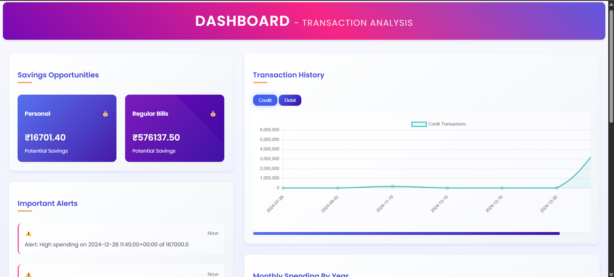

# UPI Financial Analyzer


UPI Financial Analyzer is a comprehensive web application designed to help users track their Unified Payments Interface (UPI) transactions efficiently. Users can upload screenshots of their transaction confirmations, and the application uses Optical Character Recognition (OCR) to extract relevant details like amount, date, time, and sender/receiver. This data is then stored in user-specific collections and can be visualized on a comprehensive financial dashboard, offering insights into spending patterns, cash flow, and potential savings.

The application utilizes Flask for the backend, Firebase Firestore for database storage with user-specific data isolation, and various Python libraries for OCR and data analysis. The frontend provides an intuitive interface for user registration, login, uploading images, viewing transaction history, and exploring the interactive dashboard.

## 🚀 **New Features**

* **User Authentication:** Secure registration and login with Firebase Authentication
* **User-Specific Data:** Each user's transactions are stored in isolated collections  
* **Enhanced Registration:** Full name, email, password confirmation with validation
* **Google Sign-In:** Quick authentication with Google accounts
* **Data Privacy:** Complete isolation of user data for security and privacy

## Features

* **User Management:**
  * Secure user registration with email/password
  * Google Sign-In integration
  * User-specific data isolation
  * Session management

* **Transaction Screenshot Upload:** Upload images (screenshots) of UPI transaction confirmations.
* **OCR Data Extraction:** Automatically extracts transaction details (amount, date, time, status - credited/debited, sender/receiver) from the uploaded image using Pytesseract.
* **Manual Data Entry/Edit:** Allows users to review and edit extracted details or manually input transaction data via a form.
* **Transaction Categorization:** Classify transactions as Personal, Regular Bills, or Business, and add personal references (Family, Friends, Others).
* **Priority Rating:** Rate transactions based on necessity (Necessary, Moderate, Not Necessary).
* **Firebase Firestore Integration:** Securely stores credit and debit transaction data in user-specific collections.
* **Transaction History:** View a detailed history of all recorded credit and debit transactions in tabular format.
* **Financial Dashboard:**
    * Visualize credit and debit transaction history over time (Line Chart).
    * Compare monthly spending across different years (Bar Chart).
    * Analyze cash flow with an Inflow vs. Outflow summary (Doughnut Chart).
    * Identify peak transaction times (Bar Chart).
    * Receive potential savings suggestions based on spending categories.
    * Get alerts for significant spending amounts.

## Database Structure

The application uses a user-specific database structure for complete data isolation:

```
users/
├── {user_id}/
│   ├── credit_transactions/
│   │   ├── transaction_1
│   │   ├── transaction_2
│   │   └── transaction_3
│   └── debit_transactions/
│       ├── transaction_1
│       └── transaction_2
└── {another_user_id}/
    ├── credit_transactions/
    └── debit_transactions/
```

## Technologies Used

* **Backend:** Python, Flask
* **Database:** Google Firebase Firestore with user-specific collections
* **Authentication:** Firebase Authentication
* **OCR:** Pytesseract, Pillow (PIL Fork)
* **Data Analysis:** Pandas, NumPy, Scikit-learn
* **Frontend:** HTML, CSS, JavaScript
* **Charting:** Chart.js
* **Environment Variables:** python-dotenv
* **Deployment:** Gunicorn, Docker, Railway/Render ready

## 🚀 Deployment

This application is ready for deployment on various platforms:

- **Railway.app** (Recommended for free deployment)
- **Render.com** (Free tier available)
- **Google Cloud Run** (Excellent Firebase integration)

See [DEPLOYMENT.md](DEPLOYMENT.md) for detailed deployment instructions.

## Setup & Installation

1.  **Clone the repository:**
    ```bash
    git clone https://github.com/VaishnaviVadla33/upi-finanalyzer.git
    cd upi-finanalyzer
    ```

2.  **Create a virtual environment (recommended):**
    ```bash
    python -m venv venv
    source venv/bin/activate  # On Windows use `venv\Scripts\activate`
    ```

3.  **Install dependencies:**
    ```bash
    pip install -r requirements.txt
    ```

4.  **Set up Firebase:**
    * Create a Firebase project at [https://console.firebase.google.com/](https://console.firebase.google.com/).
    * Enable Firestore Database.
    * Enable Authentication with Email/Password and Google providers.
    * Generate a private key file (Service Account JSON) for your project.
    * Set the `FIREBASE_CREDENTIALS` environment variable to the *content* of this JSON key file.

5.  **Configure Environment Variables:**
    Create a `.env` file:
    ```env
    FIREBASE_KEY_PATH=FIREBASE_CREDENTIALS.json
    FLASK_ENV=development
    ```

6.  **Run the application:**
    ```bash
    python app.py
    ```

7.  Access the application in your browser at `http://127.0.0.1:5000/`.

## Usage

1.  **Register/Login:**
    * Visit the home page and register with email/password or use Google Sign-In
    * Complete your profile information

2.  **Upload Transaction Screenshots:**
    * Navigate to the transaction upload page
    * Upload a clear screenshot of your UPI transaction
    * The OCR will automatically extract transaction details

3.  **Review and Submit:**
    * Verify extracted information
    * Add categorization and rating
    * Submit the transaction

4.  **View Dashboard:**
    * Access your personal financial dashboard
    * View transaction history
    * Analyze spending patterns and insights

## Important Notes

* **Data Privacy:** Each user's data is completely isolated and secure
* **OCR Accuracy:** Review extracted data for accuracy before submitting
* **Supported Platforms:** Optimized for PhonePe transaction screenshots
* **Production Ready:** Configured for deployment on Railway, Render, or Google Cloud

## 🎯 Live Demo

Coming Soon! The application will be deployed on Railway.app for live demonstration.

## Contributing

1. Fork the repository
2. Create your feature branch (`git checkout -b feature/AmazingFeature`)
3. Commit your changes (`git commit -m 'Add some AmazingFeature'`)
4. Push to the branch (`git push origin feature/AmazingFeature`)
5. Open a Pull Request

## License

This project is open source and available under the [MIT License](LICENSE).
